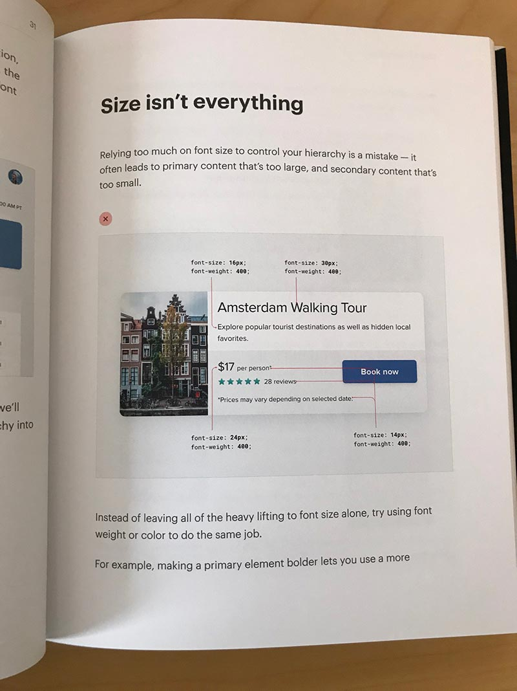

# RefactoringUIBookCover

If you have ordered the PDF version of [RefactoringUI PDF](https://refactoringui.com/book/) and want a print version feel free to use this artwork for the cover.

I used [Blurb](https://www.blurb.com/) to print a Trade Book (hard cover bound book). The cover needed some work to make it print ready because I was printing a size different from the original PDF. Feel free to use the PSD to make whatever size you need. The background artwork is the actual svg from the RefactoringUI website so it can scale nicely. The fonts on the cover were close matches to the original artwork (https://fonts.adobe.com/fonts/forma-djr-display).

## Editing the PSD
I had the save the PSD at 100 dpi to get the file size small enough for GitHub. For print it should really be 600 dpi. Everything in the PSD is vector based, just download the file, change the image dimensions to 600 dpi, plus any adjustments for the physical size of the book you wish to print and you are good to go.

## Steps to prep the PDF for print
1. Purchase and download the PDF https://refactoringui.com/book/
2. Use Adobe Acrobat (or some other PDF editing software) to edit the PDF
    - delete the first page (the original cover)
    - insert a blank page for page 1 then add the new cover [PNG](RefactoringUI-cover.png) or [JPG](RefactoringUI-cover.jpg)
    - insert a blank page at the end of the pdf and add the back cover [PNG](RefactoringUI-back.png) or [JPG](RefactoringUI-back.jpg)
3. Use the preflight tools to size/scale/crop the PDF to the correct page size for printing. This step depends on the size you will be printing the physical book. The original PDF is 7" x 9". The trade book size I printed was 8.25" x 10.25". This https://helpx.adobe.com/acrobat/kb/Change-PDF-page-size-in-MAC.html should help get you started with the prelight options

Thanks to Adam and Steve for creating such great material.

Enjoy,

Derrick

